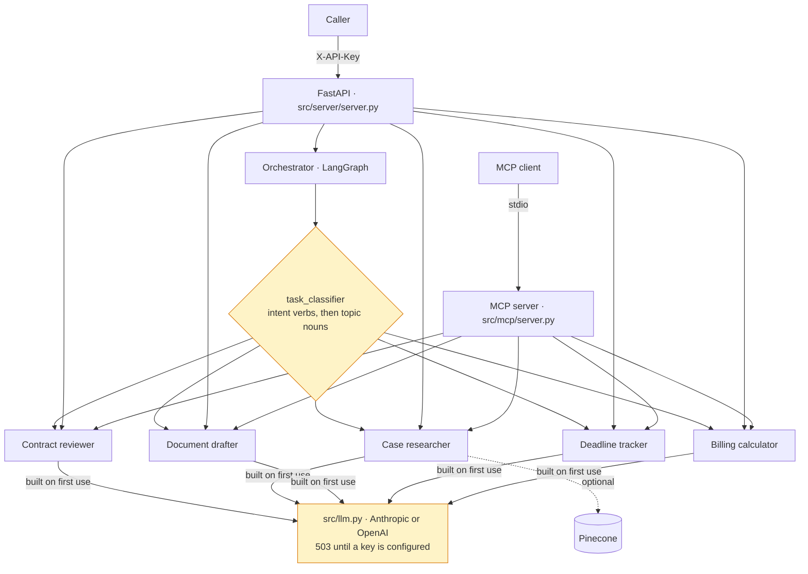

# MCP Legal Assistant

Five legal-assistant agents — contract review, case research, document
drafting, deadline tracking and billing — behind an authenticated FastAPI
service and an MCP server, on LangGraph and LangChain, with an offline test
suite and a container that boots without credentials and says what it is
missing.

[](https://github.com/daniellopez882/Legal-Assistant-Agent-with-MCP/actions/workflows/ci.yml)

> **On the claims.** The previous README ("LexPilot") promised to "automate 80%
> of legal grunt work", a table of hours saved ("4–6 hours → 15 minutes"),
> "verified citations", "no hallucinations" and "20+ document types". Nothing
> in this repository measures any of that; the agents are prompts over a model
> and every output carries a disclaimer that a licensed attorney must review
> it. Those claims are gone. Where a number appears here, the command that
> produced it appears beside it.

> **Origin.** The initial commit was authored by Ismail Sajid; a later commit
> in this repository's own history is titled "Change author from Ismail Sajid to
> Daniel Lopez", and `pyproject.toml` still names him. This repository is a
> hardening of that code and is presented as such, not as original work. There
> is no `LICENSE` file; the MIT badge that implied one has been removed, and
> the original author's terms govern.

---

## What runs



Each agent is a prompt, a model and a JSON parser (`prompt | llm |
JsonOutputParser()`), followed by validation into the Pydantic models in
`src/models.py`. The orchestrator classifies a free-text task by its verbs of
intent before its topic nouns ([ADR 0002](docs/adr/0002-route-by-intent-then-topic.md))
and runs the matching agent. The MCP server exposes the same five agents as
tools over stdio for a local client.

## What was fixed

Reproduced on the original code before each fix; every row has a test or a CI
probe.

### In the pull request

| Defect | Consequence |
|---|---|
| Five agents built `ChatOpenAI` / `ChatAnthropic` inline | No seam to substitute a model: every API test made a live call; six failed with `401` and, with a valid key, the suite would have spent money |
| `openai_api_key` defaulted to `"sk-placeholder"` and a client was built with it | A configuration error surfaced as a 500 at request time |
| Model defaults named `claude-3-5-sonnet-20241022` | A retired model |
| Routing ties broken by dictionary insertion order; `"bill client"` never matched with "the" between | Three request types reached the wrong agent, including a deadline question |
| Every party pattern required a corporate suffix; `re.IGNORECASE` defeated the capitalisation the line-start pattern relied on; `"Effective Date: January 1, 2024"` matched nothing | The commonest contract phrasing yielded no parties and no date |
| PDF extraction failures swallowed by `except: pass` | Silent empty documents |
| A bare `except:` in the deadline tracker substituted **today** for any unparseable due date | A deadline tool inventing or hiding deadlines |
| Six `HTTPException`s raised inside `except` blocks without `from e` | Lost causes in every traceback |
| `md5` for content ids; server bound to `0.0.0.0` by default on a laptop | Replaced with `sha256`; loopback by default, the container sets `0.0.0.0` explicitly |
| No CI | — |

### In the follow-up (2026-09-06)

| Defect | Consequence |
|---|---|
| `create_app()` built every agent, and every agent built its model in `__init__` | Without live credentials the container exited at startup (`LLMNotConfigured`, exit code 1) and never served `/health`. CI had built the image on every run and never started it. Models are built on first use; `/ready` reports what is missing ([ADR 0001](docs/adr/0001-one-model-factory-built-on-first-use.md), [ADR 0004](docs/adr/0004-the-container-is-booted-in-ci.md)) |
| Every `/api/v1` route unauthenticated | Anyone reaching the port could submit a client's contract to the model provider and spend the operator's credit. `X-API-Key` on every agent route ([ADR 0003](docs/adr/0003-one-api-key-fail-closed.md)) |
| `src/auth.py`: JWT over an in-memory dict, open self-registration, `SECRET_KEY` defaulting to `"dev-secret-key"`, and no agent route depending on it | Authentication that protected nothing and read as though it did. Removed with its three dependencies |
| Six routes returned `detail=str(e)` | Provider error bodies, key fragments and file paths handed to the caller. A missing credential is a 503 pointing at `/ready`; anything else a generic 500 with the detail in the log |
| `allow_origins=["*"]` with `allow_credentials=True` | A combination browsers reject; configuration now, empty in production |
| `src/__init__.py` (and `main.py` again) inserted `src/` at the front of `sys.path` | The local package `src/mcp` then shadowed the MCP SDK's `mcp`: importing the MCP server failed with `No module named 'mcp.server.stdio'; 'mcp.server' is not a package`, so `python main.py mcp` and the `legal-assistant-mcp` script were broken. Both inserts were unnecessary — every import already uses the `src.` prefix — and are gone; a test imports every console-script target |
| `[project.scripts]` pointed at `src.server.main`, a module that does not exist | The installed `legal-assistant-server` command raised `ModuleNotFoundError` |
| Single-stage image with `gcc` and `postgresql-client` in the runtime (1.37 GB), uid 1000, no `--factory`, no `.dockerignore` | Build tools shipped; uvicorn guessed the factory and warned; `COPY . .` took `.git`, the virtualenv and any `.env` into a layer. Two stages, uid 10001, explicit factory, Python health probe, `.dockerignore` |
| `docker-compose.yml` started a Postgres nothing connects to and a pgAdmin with `admin/admin`; `SECRET_KEY` defaulted | Only the API starts; `API_KEY` is required |
| Fourteen declared dependencies that nothing imports (Stripe, Twilio, Google API clients, `python-jose`, `passlib`, `python-multipart`, `aiohttp`, PyYAML, `tenacity`, `httpx-sse`, `jinja2`, `python-dateutil`, `psycopg2`, the bare `langchain`) and the settings for them | A wider install and attack surface than the code; removed, and a test now fails if a declared dependency is not imported |
| `/health` returned a naive `datetime.utcnow()` | Timezone-aware now |
| `.env.example` suggested `sk_live_` Stripe keys, Twilio and Google credentials, `SECRET_KEY` and `ENCRYPTION_KEY` | Nothing read them; the file now lists what the code reads |

## Quick start

```bash
git clone https://github.com/daniellopez882/Legal-Assistant-Agent-with-MCP.git
cd Legal-Assistant-Agent-with-MCP
cp .env.example .env            # set API_KEY; add a model key when you have one
python -m venv .venv && .venv/bin/pip install -r requirements.txt
.venv/bin/pytest --no-cov
.venv/bin/python main.py serve  # http://127.0.0.1:8000
```

With no model key the service boots, `/health` answers, `/ready` is 503 naming
the missing provider, and every agent route answers 503. With a key:

```bash
curl -s -H "X-API-Key: $API_KEY" -H 'Content-Type: application/json' \
  -d '{"document_text":"...","document_name":"nda.txt","matter_id":"M-1","client_name":"Acme","jurisdiction":"Texas"}' \
  http://127.0.0.1:8000/api/v1/contract/review
```

Container:

```bash
API_KEY=$(python -c "import secrets; print(secrets.token_urlsafe(32))") docker compose up --build
```

The image runs with `ENVIRONMENT=production` and refuses to start with the
placeholder key. The MCP server is `python main.py mcp` (stdio).

## API

Everything under `/api/v1` requires `X-API-Key`.

| Method | Path | Auth | Purpose |
|---|---|---|---|
| GET | `/health` | none | Liveness |
| GET | `/ready` | none | Readiness: model credentials per provider, key safe for the environment; 503 until both hold |
| POST | `/api/v1/contract/review` | key | Risk flags, missing protections, unfavourable terms |
| POST | `/api/v1/case/research` | key | Research memo for a question and jurisdiction |
| POST | `/api/v1/document/draft` | key | First draft of a supported document type |
| POST | `/api/v1/deadlines/check` | key | Deadline report for a firm's matters |
| POST | `/api/v1/billing/calculate` | key | Time entries and an invoice summary |
| POST | `/api/v1/orchestrate` | key | Classify a free-text task and run the matching agent |
| GET | `/api/v1/templates` | key | Supported document types |
| POST | `/api/v1/validate/time-description` | key | Quality check on a time-entry description |

Every agent response carries `legal_disclaimer`: the output is AI-assisted
analysis for a licensed attorney to review, not legal advice.

## Configuration

See [`.env.example`](.env.example).

| Variable | Default | Notes |
|---|---|---|
| `API_KEY` | `changeme-in-production` | **Refused** when `ENVIRONMENT=production` |
| `ENVIRONMENT` | `development` | The image sets `production`; that also hides the OpenAPI documents |
| `ANTHROPIC_API_KEY`, `OPENAI_API_KEY` | placeholders | Placeholders mean "not configured"; `/ready` says which is missing |
| `*_MODEL` | `claude-sonnet-5` / `gpt-4o` per agent | Each agent's model is overridable |
| `CORS_ALLOW_ORIGINS` | empty | Dev origins in development, none in production |
| `PINECONE_*` | placeholders | Case research uses the index only when configured |

## Testing

```bash
pytest --no-cov
```

129 tests, all offline (`129 passed, 2 skipped` on 2026-09-06; the two skipped
need live credentials and are deselected without them). The suite was 26
passing and 9 failing before the pull request, 90 after it. It covers the
routing table exhaustively, the model factory and its placeholder handling,
boot without credentials, authentication on every agent route, the production
refusal, CORS, that no route echoes an exception, the parser fixes, the console
scripts and the declared dependencies.

## Security

Implemented: constant-time API key on every agent route; production refuses
the placeholder key; CORS from configuration; no exception text in responses;
non-root two-stage container that boots without secrets; `bandit` and
`pip-audit` in CI; models never built from placeholder keys.

**Not implemented:** per-user identity (one shared key), rate limiting, an
audit log of who submitted which document, and any redaction before a document
is sent to a model provider. The threat model lists what remains open:
[docs/threat-model.md](docs/threat-model.md).

## Limitations

- **Client documents go to a third-party model provider** by design. Which
  provider is configuration; what they do with the text is your agreement with
  them.
- **Outputs are advisory.** The prompts instruct the agents to flag and not
  advise; the disclaimer is on every response. Nothing verifies a citation.
- **Routing is lexical.** An unrecognised request falls to case research.
- **The database models are unused.** `src/database.py` is imported by nothing;
  `docker-compose.yml` no longer starts a Postgres for it.
- **Pinecone is untested.** The case researcher uses it when configured; no test
  exercises that path.
- **The MCP server returns exception text** to its local, same-user client.

## Roadmap

1. A user store, then per-user tokens, then an audit log of submissions
2. Persistence for matters and deadlines, using the models that exist
3. A citation check against a real source before a memo is returned
4. Redaction of party names before documents leave for a provider
5. An evaluation set for each agent, scored by something other than the model

## Documentation

| Document | What it records |
|---|---|
| [ADR 0001](docs/adr/0001-one-model-factory-built-on-first-use.md) | One place builds the chat model, and it is built on first use |
| [ADR 0002](docs/adr/0002-route-by-intent-then-topic.md) | Route by verbs of intent, then topic nouns; ties by an explicit order |
| [ADR 0003](docs/adr/0003-one-api-key-fail-closed.md) | One API key on every agent route; the in-memory JWT scheme is removed; production fails closed |
| [ADR 0004](docs/adr/0004-the-container-is-booted-in-ci.md) | The container is booted and probed in CI; readiness reports what is missing |
| [Threat model](docs/threat-model.md) | Assets, boundaries, eleven threats, what remains open |

## Repository layout

```
.github/workflows/ci.yml   lint · tests · hermetic-suite guard · bandit · pip-audit · image build, boot and probes
main.py                    CLI: serve, mcp, review-contract, research, draft, templates
src/
  server/server.py         FastAPI app: probes, X-API-Key, agent routes, error mapping
  mcp/server.py            MCP stdio server exposing the five agents as tools
  agents/                  contract_reviewer, case_researcher, document_drafter, deadline_tracker, billing_calculator
  orchestrator.py          LangGraph workflow; routes through task_classifier
  task_classifier.py       intent verbs, topic nouns, explicit tie order
  llm.py                   get_chat_model, LazyChatModel, placeholder detection
  auth.py                  require_api_key
  config.py                typed settings; production validation
  pdf_parser.py            PDF, DOCX and text extraction
  models.py                Pydantic request/result models
  database.py              SQLAlchemy models (unused)
  vector_store.py          Pinecone (optional)
tests/                     129 offline tests
docs/                      ADRs, threat model
Dockerfile · docker-compose.yml · .dockerignore
```
