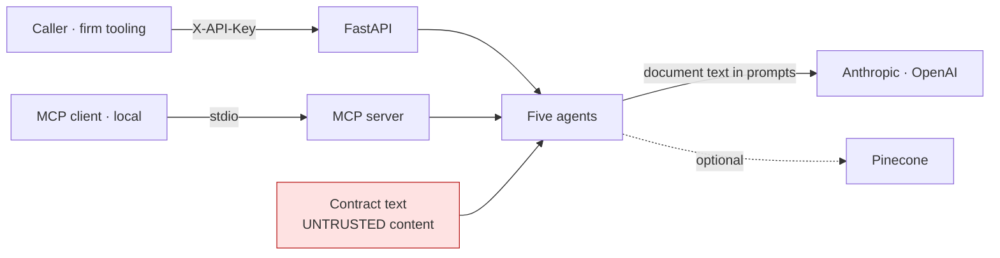

# Threat model

Scope: the FastAPI service (`/health`, `/ready`, the seven `/api/v1` agent
routes and `/api/v1/templates`), the MCP stdio server in `src/mcp/server.py`,
the five agents and the model providers they call, and the container. Out of
scope: what Anthropic and OpenAI do with the prompts they receive — client
documents reach them by design, under the operator's agreement with each
provider — and the optional Pinecone index, which no test exercises.

What was open when the work started is stated per threat; "now" is the state
on the `production-readiness` branch after PR #1 and the follow-up commits.

## What it holds

| Asset | Where | Why it matters |
|---|---|---|
| Client documents: contract text, legal questions, party names, matter ids | request bodies, model prompts, server logs | Privileged and confidential; a law firm's core duty |
| Model outputs: risk flags, research memos, drafts | responses | Advisory text a lawyer may act on; every agent attaches `LEGAL_DISCLAIMER` |
| `API_KEY` | environment | Grants every agent route |
| Model provider keys | environment | Billable; each call sends a client's document to the provider |

## Trust boundaries

Two boundaries matter most. Client documents leave the operator's control the
moment an agent runs, by design. And the document under review is written by
the counterparty — it is third-party text placed in front of the model.

## Threats

| # | Threat | Was | Now | Remaining |
|--:|---|---|---|---|
| T1 | Anyone reaching the port submits documents and spends the operator's model credit | Every `/api/v1` route open; a JWT module existed with open self-registration into an in-memory dict, a default signing secret, and no agent route depending on it | `X-API-Key` on every agent route, constant-time; the JWT scheme removed; production refuses the placeholder key; CI asserts the 401 and the refusal from a booted container ([ADR 0003](adr/0003-one-api-key-fail-closed.md)) | One shared key; no per-user identity, rate limit or audit log of who submitted what |
| T2 | Client documents sent to a third party | By design: agents send document text to the configured provider | Unchanged in kind. Which provider serves which agent is configuration; `/ready` shows which are live | No redaction or minimisation before the call; provider data-handling terms are the operator's due diligence |
| T3 | Prompt injection from the document under review | Contract text goes into the prompt with no control | Unchanged in kind: the output is advisory, carries `LEGAL_DISCLAIMER`, and the agents "identify and flag — do NOT advise" by prompt | No injection-specific filter; a reviewing attorney is the control, as the disclaimers say |
| T4 | Provider internals or secrets leak through responses | Six routes returned `detail=str(e)`: provider error bodies (request ids, key fragments), file paths, type names | `LLMNotConfigured` → 503 pointing at `/ready`; anything else → generic 500, detail in the server log; a test raises an exception naming a key and a path and asserts neither appears | The MCP server still returns exception text to its (local, same-user) client; logs hold the detail and need the service's access control |
| T5 | The service cannot start, or starts wrong | Without model credentials `create_app()` raised and the container exited before `/health`; CI had never run the image | Models built on first use; `/health` always serves; `/ready` 503 with the missing provider named; CI boots and probes the image ([ADR 0001](adr/0001-one-model-factory-built-on-first-use.md), [ADR 0004](adr/0004-the-container-is-booted-in-ci.md)) | — |
| T6 | Secrets in the image or repository | No `.dockerignore` (`COPY . .` took `.git`, the virtualenv and any `.env`); `.env.example` suggested `sk_live_` Stripe keys and an `ENCRYPTION_KEY` nothing read; compose defaulted `SECRET_KEY` and gave pgAdmin `admin/admin` | `.dockerignore`; non-root two-stage image; the unused settings and services removed; `.env` gitignored | No secret-scanning step in CI; nothing is known to have been committed |
| T7 | Vulnerable dependencies | Fourteen declared packages nothing imported widened the surface (Stripe, Twilio, Google clients, jose, passlib, …) | Only imported packages remain; `pip-audit` and `bandit` run in CI (see the README for the audit result at the time of writing) | Version ranges are lower bounds, so an audit failure is the signal to pin |
| T8 | Cross-origin abuse from a browser | `allow_origins=["*"]` with `allow_credentials=True` | `CORS_ALLOW_ORIGINS` from configuration; dev origins in development, none in production | — |
| T9 | Wrong agent for a legal request | Ties in a keyword table were broken by dictionary order; three request types misrouted, one of them a deadline question | Intent verbs before topic nouns, explicit tie order, exhaustive tests ([ADR 0002](adr/0002-route-by-intent-then-topic.md)) | Lexical routing; an unrecognised request falls to case research |
| T10 | A deadline invented or hidden | A bare `except:` substituted *today* for any unparseable due date | Unparseable dates are skipped and logged | The model's dates are still the model's; the agent computes days remaining, it does not verify court rules |
| T11 | The system is mistaken for what its README said it was | "No hallucinations", "verified citations", "20+ document types", a table of hours saved | The README describes what runs and what was measured; the MIT badge that implied a licence file is gone (there is none) | — |

## Failure modes that fail closed

- Production start with the placeholder `API_KEY`: refused at settings
  construction, before the server binds.
- No model credentials: `/ready` is 503 and every agent route is 503; nothing
  is sent anywhere.
- An unknown or unrecognised request type: routed to the least consequential
  agent (case research), never to billing or drafting.
- Removing the fake-model fixture or building a client directly in an agent:
  CI fails.
- Placeholder provider keys: never used to construct a client.
